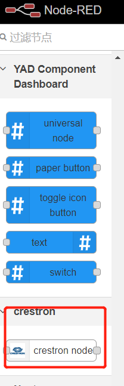
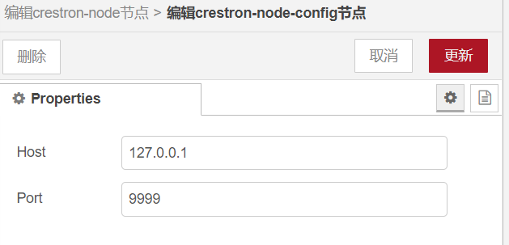
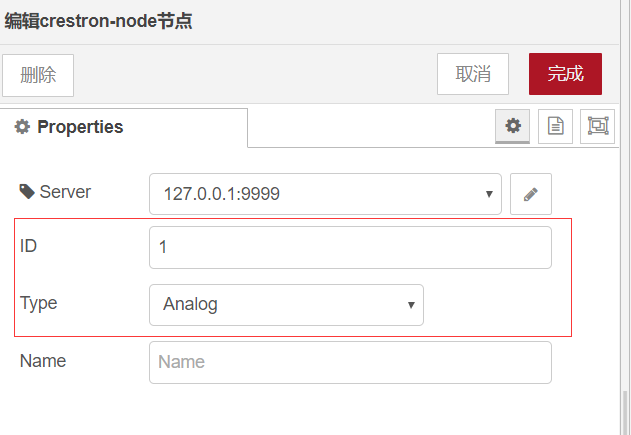
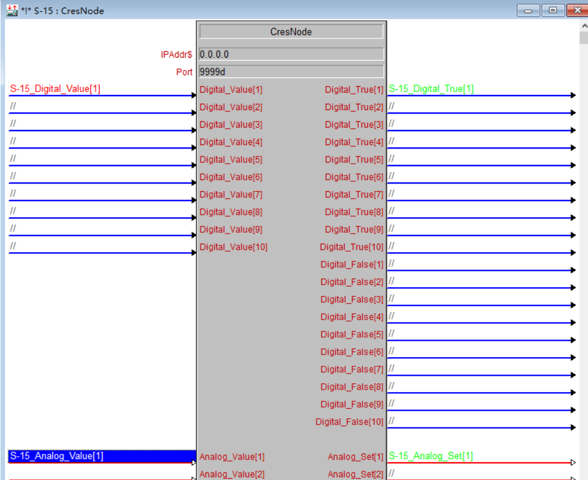
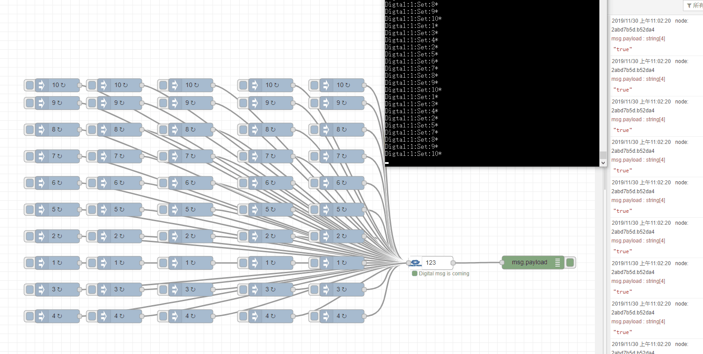
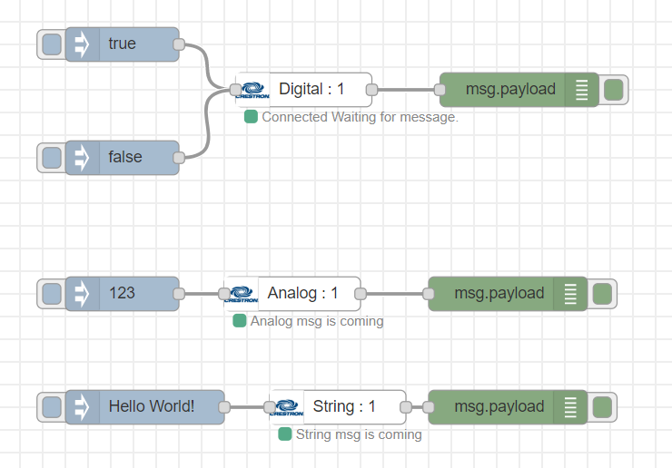

If you think this project is very helpful to you, you can give this project a star⭐. You can also buy me a cup of coffee, hh (● '◡' ●)
I will keep updating.

Thank you
## **WARNING**
It is not recommended to use the SIMPL 4.14 version, when I use it, it will cause some strange problems in the program (cause other macros to fail). So I rolled back the version to 4.11.

This is My Software Version.

**SIMPL** : simpl_windows_4.11.06.01.1

**CRESTRON_DATABASE** : crestron_database_89.05.002.00

**DEVICE_DATABASE** : device_database_115.00.002.00

[](https://paypal.me/songzh96?locale.x=zh_XC)
# Nodered-Crestron
This is a NodeRed Plugin to Crestron Prefessor(Use Tcp Socket to commucation)

The Plugin has 3 types,there is

**Digital**

Accept Value is true/false or 0/1

**Analog**

Accept Value is 0-65535

**String**

Accept Value is any String(length is depend crestron marco)

**技术交流群：107927710，里面有很多大神呦**

**PS:This is a free trial**

# How to use
1. install nodejs and npm in your computer
2. install node-red `sudo npm install -g node-red`
3. install crestron-node `sudo npm install -g node-red-contrib-crestron`
4. run node-red
5. use crestron-node

   
6. config Crestron Professor Server 

   
7. Fill in the ID and choose the data type,Make sure to match the pins of Crestron's macro file
   
   
8. send the msg to the node
9. Open Crestron SIMPL Software to edit CresNode 
   
   


### CHANGE LOG
**V 1.0.0** First version

**V 1.0.1** Fixed no digital output

**V 1.0.2** add 10 inputs, "Serial -> String" , Added data type to label name for easy differentiation

**V 1.0.3** Change node label, Easy to identify

**V 1.0.4** Update Demo

**V 1.0.5** fixed Digital Node ouput

**V 1.0.6** Support Crestron 2 Series Control System®

**V 1.0.7** Support Crestron 4 Series Control System®(Will not continue to update for now)

**V 1.0.8** 
1. Update README
2. false signal not need FeedBack now 

**V 1.1.0** Support Get FeedBack,Please check demo to know how to use
# TEST
I created 50 nodes and sent 50 messages to the Crestron host every 1s, 
which is equivalent to a message of 20ms. After a long test, the information was sent steadily

   


# DEMO
   


```
[{"id":"34261440.6a55fc","type":"crestron-node","z":"ff2337eb.0985b8","server":"52a4d5a6.b307cc","cid":"1","ctype":"Digital","name":"","x":330,"y":3420,"wires":[["f9e0f22e.47fed"]]},{"id":"4f260411.c27f4c","type":"inject","z":"ff2337eb.0985b8","name":"","topic":"","payload":"true","payloadType":"bool","repeat":"","crontab":"","once":false,"onceDelay":0.1,"x":170,"y":3380,"wires":[["34261440.6a55fc"]]},{"id":"5133cbb1.818fa4","type":"inject","z":"ff2337eb.0985b8","name":"","topic":"","payload":"false","payloadType":"bool","repeat":"","crontab":"","once":false,"onceDelay":0.1,"x":170,"y":3480,"wires":[["34261440.6a55fc"]]},{"id":"f9e0f22e.47fed","type":"debug","z":"ff2337eb.0985b8","name":"","active":true,"tosidebar":true,"console":false,"tostatus":false,"complete":"false","x":520,"y":3420,"wires":[]},{"id":"e6a48e93.8382","type":"crestron-node","z":"ff2337eb.0985b8","server":"52a4d5a6.b307cc","cid":"1","ctype":"Analog","name":"","x":320,"y":3600,"wires":[["88c34897.52f8f8"]]},{"id":"38457b10.e8e674","type":"inject","z":"ff2337eb.0985b8","name":"","topic":"","payload":"123","payloadType":"num","repeat":"","crontab":"","once":false,"onceDelay":0.1,"x":170,"y":3600,"wires":[["e6a48e93.8382"]]},{"id":"88c34897.52f8f8","type":"debug","z":"ff2337eb.0985b8","name":"","active":true,"tosidebar":true,"console":false,"tostatus":false,"complete":"false","x":510,"y":3600,"wires":[]},{"id":"1d423a1c.444716","type":"crestron-node","z":"ff2337eb.0985b8","server":"52a4d5a6.b307cc","cid":"1","ctype":"String","name":"","x":360,"y":3700,"wires":[["bbce66c1.5813f8"]]},{"id":"c605c078.97ddd","type":"inject","z":"ff2337eb.0985b8","name":"","topic":"","payload":"Hello World!","payloadType":"str","repeat":"","crontab":"","once":false,"onceDelay":0.1,"x":190,"y":3700,"wires":[["1d423a1c.444716"]]},{"id":"bbce66c1.5813f8","type":"debug","z":"ff2337eb.0985b8","name":"","active":true,"tosidebar":true,"console":false,"tostatus":false,"complete":"false","x":510,"y":3700,"wires":[]},{"id":"1a1b9880.d45828","type":"inject","z":"ff2337eb.0985b8","name":"","topic":"","payload":"getState","payloadType":"str","repeat":"","crontab":"","once":false,"onceDelay":0.1,"x":190,"y":3820,"wires":[["e6a48e93.8382","1d423a1c.444716","34261440.6a55fc"]]},{"id":"52a4d5a6.b307cc","type":"crestron-node-config","z":"","host":"192.168.1.10","port":"9999"}]
```
